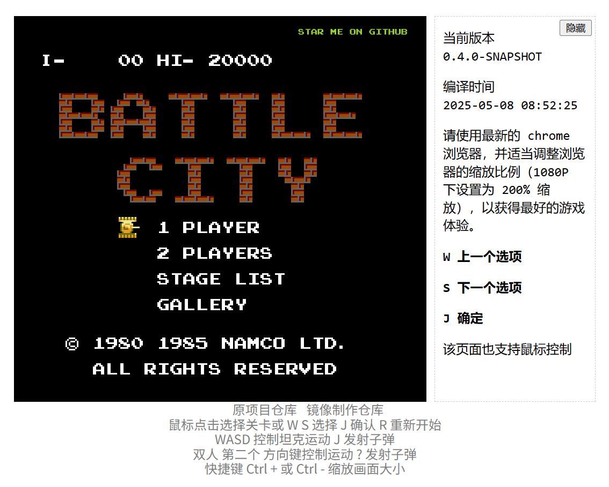

# 坦克大战复刻版（Battle City Remake）

游戏地址: https://shinima.github.io/battle-city

游戏详细介绍见知乎专栏文章: [https://zhuanlan.zhihu.com/p/35551654](https://zhuanlan.zhihu.com/p/35551654)

[GitHub仓库地址](https://github.com/feichao93/battle-city/)

该 GitHub 仓库的版本是经典坦克大战的复刻版本，基于原版素材，使用 React 将各类素材封装为对应的组件。素材使用 SVG 进行渲染以展现游戏的像素风，可以先调整浏览器缩放再进行游戏，1080P 屏幕下使用 200% 缩放为最佳。此游戏使用网页前端技术进行开发，主要使用 React 进行页面展现，使用 Immutable.js 作为数据结构工具库，使用 redux 管理游戏状态，以及使用 redux-saga/little-saga 处理复杂的游戏逻辑。

如果游戏过程中发现任何 BUG 的话，欢迎提 [issue](https://github.com/shinima/battle-city/issues/new)。

## 部署说明

首先感谢原作者的开源。[原项目地址](https://github.com/feichao93/battle-city)

有需要帮忙部署这个项目的朋友,一杯奶茶,即可程远程帮你部署，需要可联系。  
微信号 `E-0_0-`  
闲鱼搜索用户 `明月人间`  
或者邮箱 `firfe163@163.com`  
如果这个项目有帮到你。欢迎start。

有其他的项目的汉化需求，欢迎提issue。或其他方式联系通知。

### 镜像

从阿里云或华为云镜像仓库拉取镜像，注意填写镜像标签，镜像仓库中没有`latest`标签

容器内部端口 3000

```bash
swr.cn-north-4.myhuaweicloud.com/firfe/battle-city:2025.05.08
```

### docker run 命令部署

```bash
docker run -d \
--name battle-city \
--network bridge \
--restart always \
--log-opt max-size=1m \
--log-opt max-file=3 \
-p 3000:3000 \
swr.cn-north-4.myhuaweicloud.com/firfe/battle-city:2025.05.08
```
### compose 文件部署 👍推荐

```yaml
#version: '3.9'
services:
  battle-city:
    container_name: battle-city
    image: swr.cn-north-4.myhuaweicloud.com/firfe/battle-city:2025.05.08
    network_mode: bridge
    restart: always
    logging:
      options:
        max-size: 1m
        max-file: '3'
    ports:
      - 3000:3000
```

## 修改说明
 
增加修改部分具体见 [修改说明](./修改说明.md)。

`./README.md` 增加 `## 部署说明`、`## 修改说明`、`## 效果截图` 部分。

增加目录 `./图片`
新增文件 `./.dockerignore`、`./Dockerfile`、`./修改说明.md`、`./本地调试命令记录.md` 

## 效果截图




## 开发进度：

<details>
  <summary><b>Milestone 0.2（已完成于 2018-04-16)</b></summary>

- [x] 游戏的基本框架
- [x] 单人模式
- [x] 展览页面
- [x] 关卡编辑器与自定义关卡管理

</details><br>

<details>
  <summary><b>Milestone 0.3（已完成于 2018-11-03）</b></summary>

- [x] 性能优化
- [x] 完整的游戏音效（有一些小瑕疵）
- [x] 双人模式（已完成）

</details><br>

**Milestone 1.0（看起来遥遥无期 /(ㄒ o ㄒ)/~~）**

- [ ] 更合理的电脑玩家
- [ ] 完整的设计、开发文档
- [ ] 基于 websocket 的多人游戏模式

## 本地开发

1.  克隆该项目到本地
2.  运行 `yarn install` 来安装依赖 （或者使用 `npm install`）
3.  运行 `yarn start` 开启 webpack-dev-server，并在浏览器中打开 `localhost:8080`
4.  运行 `yarn build` 来打包生产版本，打包输出在 `dist/` 文件夹下

`devConfig.js` 包含了一些开发用的配置项，注意修改该文件中的配置之后需要重启 webpack-dev-server
